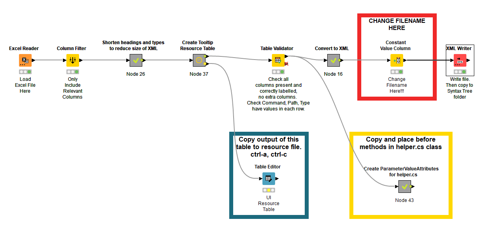

# Syntax Tree configuration files

The tab-completion algorithm uses a syntax tree to determine valid completion options. Each command has its own syntax tree which is loaded at first use of  that command.

Command syntaxes  typically follow similar patterns. They start with one or several command words to identify which programme or module within the system is going to process the command. For instance, Conda commands start with the command conda, followed by one or more sub-commands such as list, install, config. The syntax tree identifies all permutations of commands and sub-commands, the leaves of the tree identifying callable commands and their arguments.

The syntax tree starts with the base command (e.g. `conda`) and then identifies each of the sub-commands that may be added (e.g. `install`). The leaves are identified by concatenating the commands with a period (`.`) to create a path (e.g. `conda.install`).

Each leaf can be followed by either another sub-COMMAND (e.g. `install`), an OPTIONAL parameter (e.g. `--help`), a PARAMETER with values (e.g. `--name environment_name`), or POSITIONAL parameters (e.g. `conda install Package_1 Package_2 Package_3`). The syntax tree has one row for each argument that may be added to that command. Therefore, the same path `conda.install` may appear in the syntax tree with several rows identifying unique arguments. The arguments for each leaf node must be unique and must identify their type.

As the user enters text at the prompt, the algorithm scans the syntax tree to identify suitable suggestions for next words. It uses the command path (`conda.install`) to filter results as the command is entered; and then suggest further commands and their arguments as more text is entered. Note that certain optional arguments may appear more than once, whilst others are unique; and some parameter arguments may also have more than one value, whilst others are unique. The algorithm also needs to identify when the command is expecting a value to be entered and not to suggest further arguments at that point; ideally suggesting possible values where the choice is limited.

PowerShell parses input at the command line to create a  PowerShell Command Abstract Syntax Tree (CommandAST); note this is different from this *language* syntax tree used to describe permissible commands and arguments. This contains a parsed list of words entered by the user when the `tab` key is pressed. The final leaf in the command is the partial word to be completed, and for which suggestions are required. The algorithm visits the CommandAST and constructs a list of tokens, each token representing a word entered by the user. In this description, where the word token is used, it means an individual word entered by the user at an ordered position on the command line. The algorithm uses knowledge in the language syntax tree to enhance information about tokens in the CommandAST to suggest likely user input.

The language syntax tree needs the following information to determine for any command path (leaf) possible future tokens and whether additional information (parameter values) is also required:

- COMMAND type identifies additional sub-commands that may be added to the command path to increase the commands specificity. For example, if the command path is `conda` then there are COMMAND entries for `activate`, `clear`, `install`, ... which then lead to the next level in the tree `conda.activate`, `conda.clear`, `conda.install`. The sub-command text is recorded within the ARGUMENT column of the syntax tree and MULTIPLE_USE is `false`. An alias for the command can also be recorded in the ALIAS column.
- OPTIONAL type are parameter flags (e.g. `--help`) that do not require parameter values. The text for the parameter is recorded in ARGUMENT, and an ALIAS may be entered. By convention, the ARGUMENT column should hold the most descriptive text, and the ALIAS the shortened form. For example, ARGUMENT : `--help`, ALIAS: `-h`. Some parameter flags may be used multiple times; if this is the case the MULTIPLE_USE must be `true` otherwise it must be `false`.
- PARAMETER type are parameters that are followed by values. As with OPTIONAL, they may have both an ARGUMENT and an ALIAS. The must also indicate whether they are MULTIPLE_USE. In addition, PARAMETER type must identify what value information is required. This is recorded in the PARAMETER column, which is a unique value, in capital letters, that the algorithm uses to determine what values to suggest. The MULTIPLE_PARAMETER flag must be set to indicate whether multiple values can be entered (`true`) or not (`false`).
- POSITIONAL type are parameter values that are entered after the command, but not preceded by a PARAMETER identifier. For instance, `conda.activate` is followed by a positional parameter to indicate the environment to be activated. The POSITIONAL type has no ARGUMENT or ALIAS; but does require the PARAMETER, MULTIPLE_USE (always `false`) and MULTIPLE_PARAMETER columns (can be `true` or `false`) with the same rules as a PARAMETER type.

Each command path will have one or more entries in the syntax tree, one for each COMMAND, OPTIONAL, PARAMETER or POSITIONAL suggested option. Each can also have a descriptive tooltip to provide the user with additional information in situations where tooltips can be displayed. It is recommended to keep tooltips as short as possible - they are helpful prompts and not intended as a substitute for help text or a language specification.

The syntax tree is stored in a table with the following columns.
| Column Name         | Type    | Mandatory  | Description                                                                                    |
|-------------------- |-------- |----------- |----------------------------------------------------------------------------------------------- |
| COMMAND             | string  | yes        | The command or sub-command token entered on at the prompt.                                     |
| COMMAND_PATH        | string  | yes        | The full command (command and sub-command tokens). Each argument   separated by a period (.).  |
| TYPE                | string  | yes        | The type of argument (COMMAND, OPTIONAL, PARAMETER, POSITIONAL).                               |
| ARGUMENT            | string  | yes [1]    | The text representation of argument.                                                           |
| ALIAS               | string  | no         | An alternate text representation of the argument.                                              |
| MULTIPLE_USE        | bool    | yes        | True if the argument can appear multiple times on The command line.                            |
| PARAMETER           | string  | no [2]     | The name of the parameter value. The name is used to call specic   parameter value handlers.   |
| MULTIPLE_PARAMETER  | bool    | no [2]     | True if the parameter has multiple values.                                                     |
| TOOLTIP             | string  | no         | Short descriptive help text for the argument.                                                  |

Note 1: The argument is mandatory for COMMAND, OPTIONAL and PARAMETER types; but does not apply to the POSITIONAL type.
Note 2: The parameter and multiple parameter columns are mandatory for PARAMETER and POSITIONAL types; but does not apply to COMMAND and OPTIONAL types.

## Converting Microsoft Excel file to XML

KNIME is an open-source low-code data science platform and can be downloaded from [here](https://www.knime.com/). The repository contains a workflow that reads the Microsoft Excel file specifying the syntax tree specification and performs the following tasks:

- Performs some basic checks to ensure that all the required columns exist and those that need mandatory values are complete.
- Compresses headers and categorical information to reduce the size of the XML file.
- Creates a table of tooltip texts for the tooltip resource file and replaces the tooltip text with references in the XML file.
- Writes the XML syntax tree to a file.
- Creates a table of ParameterValue attributes to precede methods in the helper.cs file. Note: The code uses the ParameterValue attribute and reflection to identify the correct method to generate parameter value suggestions.
