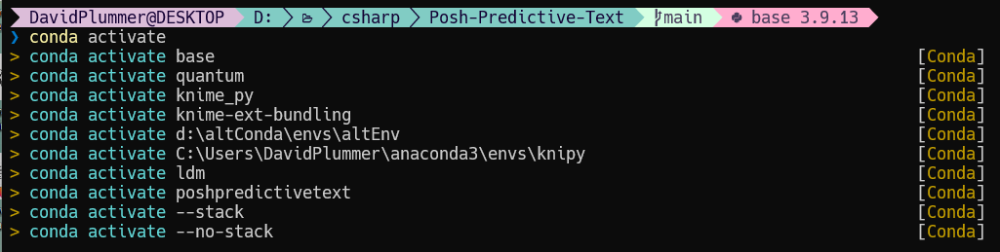
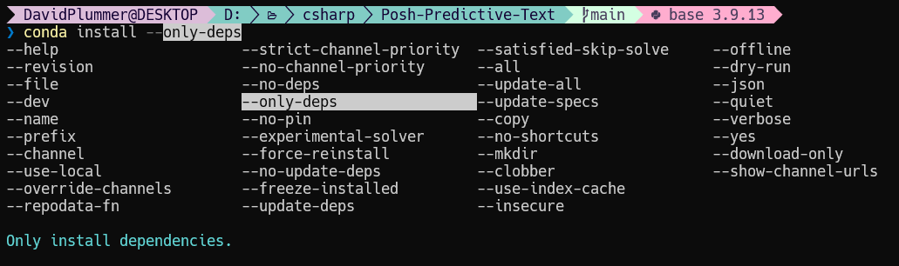

.. Posh Predictive Text 

====================
Posh Predictive Text
====================

*PowerShell module providing predictive text completions for common CLI tools.*

Most people will be familiar with predictive text on mobile phones.
Posh-predictive-text brings the same capability to the PowerShell command line
interface for common CLI tools used within the software development and data
science community.

Modern command line tools are highly configurable and have many parameters. It
is difficult to remember them all. Posh Predictive Text improves productivity,
not only by providing suggested completions, but also providing a pop-up list
of suggestions with tooltips. These tooltips remove the need to break off from
enter the command and search documentation for the correct parameter name.

In addition, Posh Predictive Text is also able to suggest a limited number of
parameter arguments. For instance when using conda to activate an environment
a list of environments is shown.

PoshPredictiveText provides suggested completions in the following situations:

- When a partial argument is entered and the ``tab`` key is pressed. Successive suggestions
  appear each time the ``tab`` key is pressed.
- Pressing ``ctrl + space`` displays a popup list of options with tooltips.
- If PSReadLine options ``-PredictionSource`` is set to use the
  plugin and ``-PredictionViewStyle`` is set to ListView then suggestions will appear below the
  command line.

Supported Command Line tools
----------------------------

Predictive text is available for the following commands line tools.

- conda

If a tools is not supported then please consider helping by developing the syntax tree
file needed to support it. Further information is available in the developer documentation.

Sponsorship
-----------

We all love open-source software. It's the freedom to use it and adapt it as you like. Its the no
cost option. However, without funding open-source projects die. If you find this software useful
then consider sponsoring the developers. It doesn't have to be a lot. The cost of a cup of coffee
will do. Little contributions help and it is all very much appreciated.

.. list-table::
   :header-rows: 1

   * - GitHub Sponsors
     - Ko-fi

   * - .. raw:: html
       
         <iframe src="https://github.com/sponsors/DiaAzul/button" title="Sponsor DiaAzul" height="35" width="116" style="border: 0;">
         </iframe>

     - .. raw:: html

         

Screenshots
-----------

   *Suggestions appear in the drop-down list when Posh Predictive Text is configured as a
   PSReadLine plugin.*

  *Pressing ``ctrl+space`` shows a pop-up list of suggested commands with tooltips.*

The following short video shows Posh Predictive Text in action.

.. raw:: html

   <video src=https://user-images.githubusercontent.com/28156158/190742185-8842a5cf-3cc5-4945-8571-66d9ad6b4e6e.mp4 controls="controls" style="max-width: 730px;">
   </video>

|

Quick Start
-----------

Posh Predictive Text is available from PowerShell Gallery and is installed and activated 
using the following instructions. A more detailed set of instructions are available on the
installation page.

Prerequisites
^^^^^^^^^^^^^

Posh predictive text requires PowerShell version 7.2 or greater and PSReadLine version 2.2.6
or greater.

Download and install PowerShell module
^^^^^^^^^^^^^^^^^^^^^^^^^^^^^^^^^^^^^^

Install PoshPredictive text from the PowerShell Gallery. This will download the module to
the local user account. You may be asked for permission if you have not already set PowerShell
gallery as trusted source.

.. code-block:: PowerShell
   
   Install-Module -name PoshPredictiveText

Update PowerShell profiles
^^^^^^^^^^^^^^^^^^^^^^^^^^

Add the following commands to the PowerShell profile. To locate the PowerShell profile open
a command prompt and type `$PROFILE`.

.. code-block:: PowerShell

   Set-PredictiveTextOption -RemoveCondaTabExpansion
   Install-PredictiveText

.. toctree::
   :maxdepth: 3
   :caption: Contents:
   :hidden:

   pages/InstallationAndSetup
   pages/Features/Features
   pages/PowerShellHelp
   pages/Development/Development
   pages/UpgradingAndChangeLog
